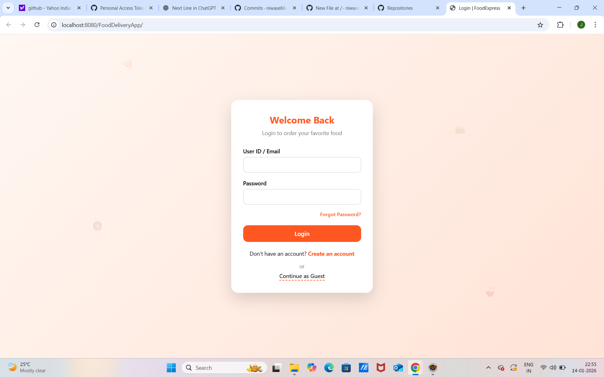
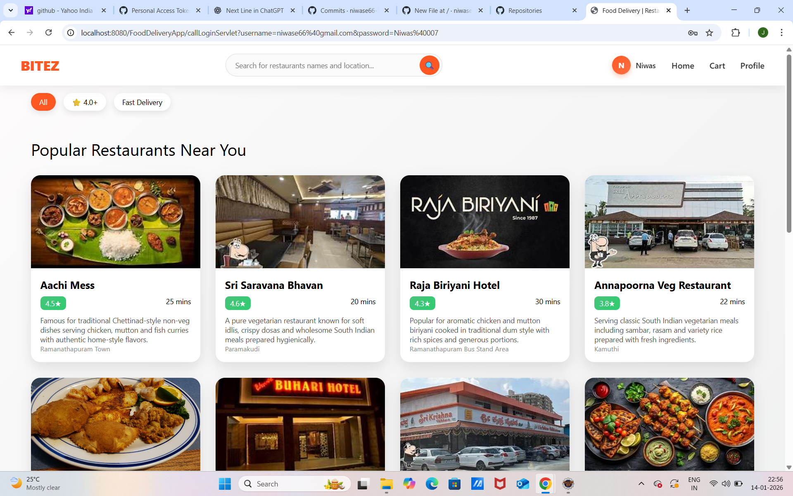

# 🍔 FoodDeliveryApp-Java

A full-stack Java web application that simulates a real-world food delivery platform (inspired by Swiggy/Zomato).

---

## 🚀 Features

### 👤 User Module
- User registration & login
- Guest user access (skip login)
- Profile sidebar with user details
- Dark mode toggle
- Logout confirmation popup

### 🏪 Restaurant Module
- Browse restaurants with ratings & ETA
- Veg & Non-Veg restaurants
- Search by name/location
- Uniform image handling (fallback support)

### 🛒 Cart & Orders
- Add to cart with quantity control
- Checkout with address selection
- Order history & tracking

- ## 📸 Screenshots

### Login Page

### Restaurant Listing

