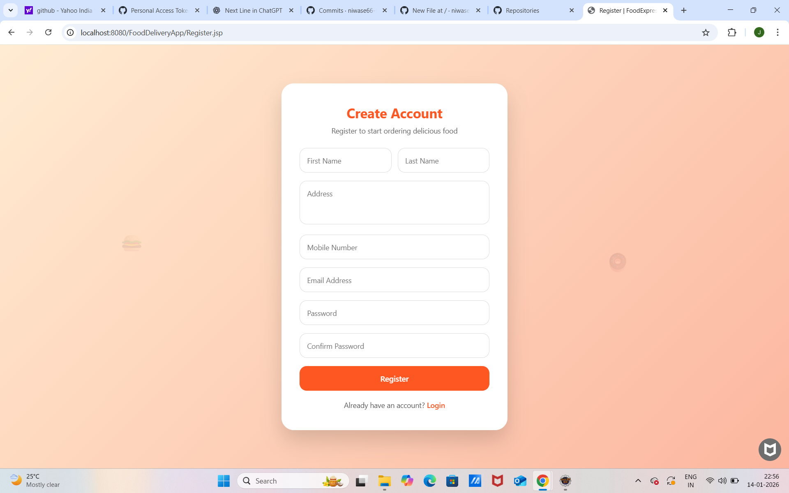
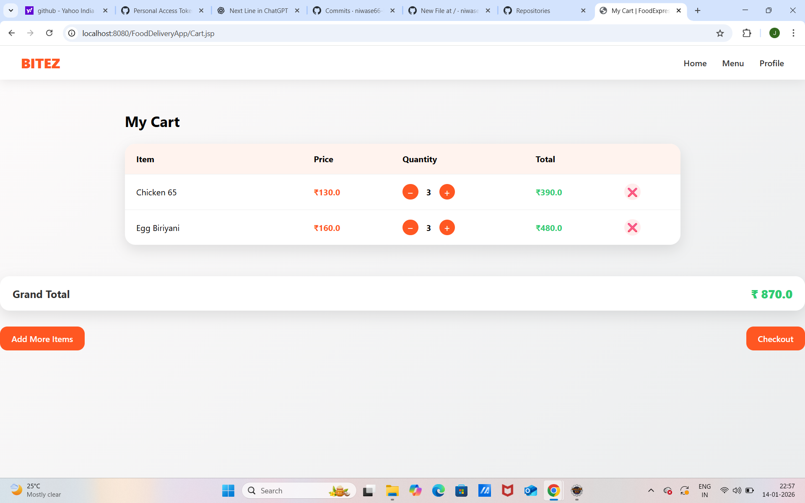
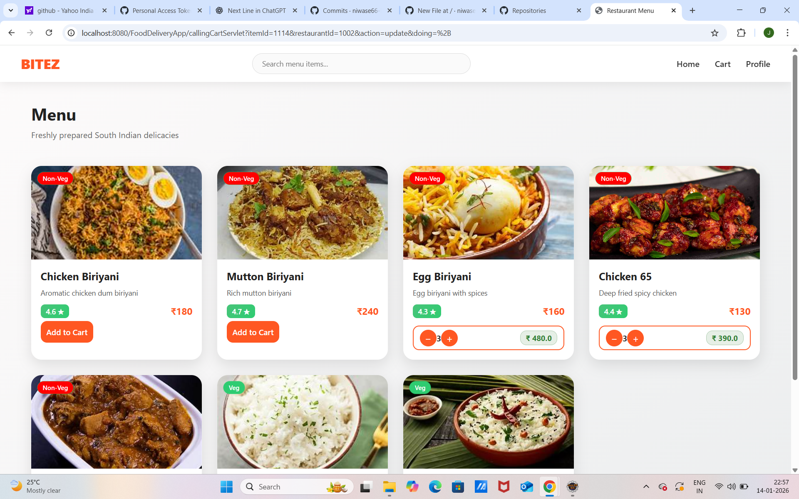
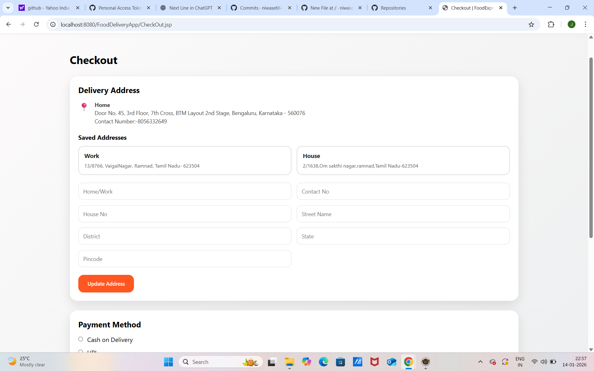
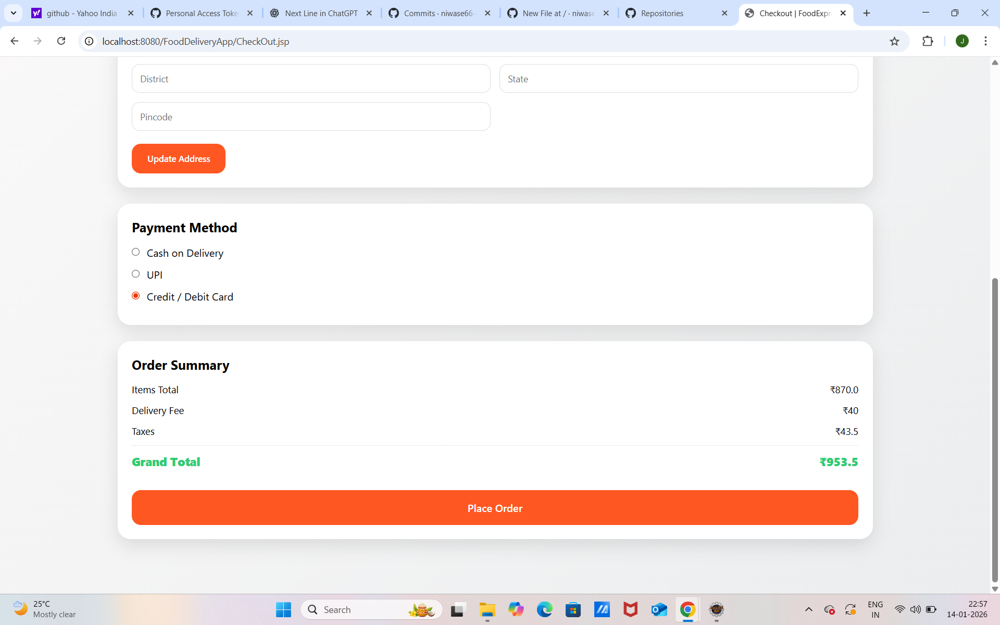
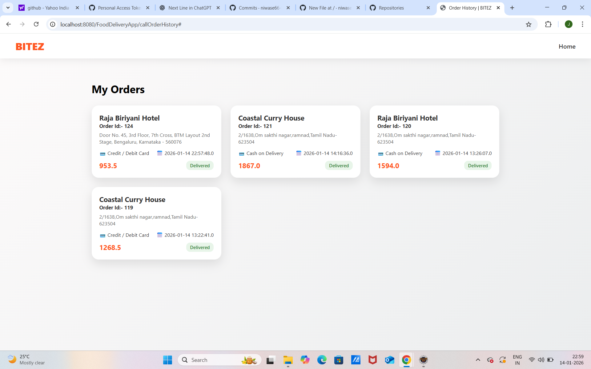
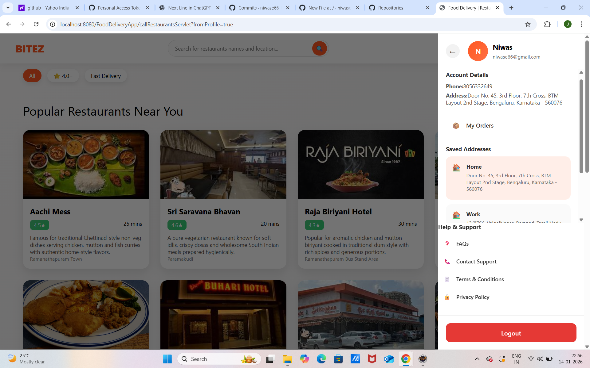

# 🍔 FoodDeliveryApp-Java

A full-stack Java web application that simulates a real-world food delivery platform (inspired by Swiggy/Zomato).

---

## 🚀 Features

### 👤 User Module
- User registration & login
- Guest user access (skip login)
- Profile sidebar with user details
- Dark mode toggle
- Logout confirmation popup

### 🏪 Restaurant Module
- Browse restaurants with ratings & ETA
- Veg & Non-Veg restaurants
- Search by name/location
- Uniform image handling (fallback support)

### 🛒 Cart & Orders
- Add to cart with quantity control
- Checkout with address selection
- Order history & tracking

## 📸 Application Screenshots

### 🔐 Login Page

### 📝 Register Page

### 🏠 Home Page

### 🔎 Login from Home Page

### 🛒 Cart Page

### 📋 Menu Page

### ➕ Add Address

### 🚚 Checkout (Login Required)

### 📦 Checkout – Step 1

### 📦 Checkout – Step 2

### 📞 Contact Details

### ✅ Order Confirmation

### 📜 Order History

### 📦 Order Item Details

### 👤 Profile Sidebar

### 🚪 Logout Confirmation

## 🏗 Project Architecture

- MVC Architecture
- JSP – View Layer
- Servlets – Controller Layer
- DAO & DAOImpl – Data Access Layer
- MySQL – Database
- JDBC – Database Connectivity

## 🗄 Database Design

### Tables
- users
- restaurants
- menu
- cart
- orders
- order_items
- all_address

## ▶ How to Run the Project

1. Clone the repository
2. Import into Eclipse as Dynamic Web Project
3. Configure Apache Tomcat 10+
4. Create MySQL database and tables
5. Update DB credentials in JDBC connection
6. Run on server

## 🛠 Tech Stack

- Java
- JSP & Servlets
- JDBC
- MySQL
- HTML5
- CSS3
- Apache Tomcat

## ⭐ Key Highlights

- Industry-style UI inspired by Swiggy/Zomato
- Guest user browsing without login
- Dynamic restaurant & menu rendering
- Responsive UI (mobile + desktop)
- Address management with multiple addresses
- Order history with item-level details

